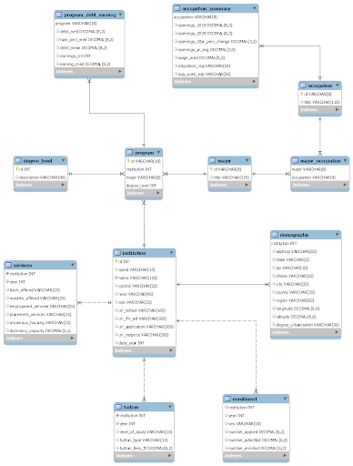

#   **Project Report**

### Contributors: 
Anshuman Jain  ●  Cailean Geary  ●  Jason Baker  ●  Tim Chung

## **Project Demo Video**

https://drive.google.com/file/d/1EXFHtzSjzimG4agG7C8MSc10SwvffSys/view?usp=sharing

## **Introduction**


According to[ a 2018 Econofact article](https://econofact.org/going-away-to-college-school-distance-as-a-barrier-to-higher-education), over 56% of undergraduates at public universities are enrolled less than an hour away from home and nearly 70% attend a college within a two hour drive. This suggests that many students are simply choosing the college closest to home even if a better option exists elsewhere. Given the myriad differences among universities (e.g., enrollment sizes, program offerings, tuition costs, institutional type, etc.) combined with the abundance of similar-looking marketing material sent to high school seniors, it’s no wonder that students could become overwhelmed and just pick the closest school.


What if students could receive data-driven recommendations that most aligned with their preferences, regardless of geography? What if students could also evaluate degrees and majors based on financial return on investment using employment data instead of just anecdotes from successful alumni? To provide such insights, we developed a college search portal to assist prospective students identify suitable undergraduate colleges and universities drawn from federal higher education data, as well as earning potential based on national employment and wage data. In addition to searching and ranking capabilities, users can benefit from college viewbook pages that showcase each institution in an information-rich and aesthetically-pleasing context.


## **Project Goals & Application Functionality**

The primary goal of the College Search Portal was to enable prospective students to discover and evaluate universities based on objective data, drawn from reliable national sources, rather than relying on slick marketing pitches from the colleges themselves or questionable online pay-for-play ranking sites. Accordingly, we sought to build a database-driven web portal that aggregated credible data and then made it accessible via user-friendly search, ranking, and viewing pages.

Toward that end, we aggregated data from four primary sources: the Integrated Postsecondary Education Data System (IPEDS) for institutional information, College Scorecard for student financial outcomes, Bureau of Labor Statistics (BLS) for employment and wage details, and a National Center for Education Statistics (NCES) Crosswalk dataset to align college majors to employment categories. These will be discussed in more detail in the Data section of this report but, in summary, the IPEDS, Scorecard, and NCES datasets come from the U.S. Department of Education while the BLS dataset is from the U.S. Bureau of Labor Statistics. Unlike institutional self-promotion or qualitative analysis, each dataset reflects extensive federal data collection initiatives and contains far more variables and historical records than we needed for our initial portal.

Our application is designed around four primary pages: Home/Viewbook, Top 10 Lists, Earnings Comparison, and Criteria Search.


*   **Home**: This is the application’s home page which welcomes the user and contains a navigation bar with links to the other primary pages. It is both visually-rich and informative while serving as a jumping-off point for further exploration and inquiry. 
*   **Viewbook**: The viewbook is a dynamically-generated page for an individual college, which provides a visual and data-rich overview of the institution. It is typically reached as the endpoint of a search or top 10 query. Users easily and intuitively navigate amongst the page’s components to explore information about the selected college.   
*   **Top 10 Colleges**: This page allows users to view a customized top 10 list of colleges based on one of three popular parameters: acceptance rate, tuition fees, and earnings. Additionally, users can filter the results based on geography (region or urbanization level), institution size, control (public, private, for-profit), and degree level. Results can also be ordered from highest to lowest or the reverse and then can be selected in order to see the corresponding institutional viewbook page.
*   **Earnings Comparison**: This page gives users the chance to learn what earnings actually results from leading college majors on both the undergraduate and graduate level. Once the user selects the major area and degree level, the system generates a report containing starting salary, overall salary, job growth, debt, and return on investment.
*   **Criteria Search**: This page allows users to select a series of parameters from which to discover a matching undergraduate college or university. Users can select from any combination of geography (state or region), institution size, selectivity, available major, campus housing, or control (public, private, for-profit) and then report up to 100 results. Any result can be selected in order to see the corresponding institutional viewbook page.


## **Architecture**

The architecture associated with the College Search Portal includes technologies for data preprocessing, back-end database hosting, and front-end user interface.

While not actively part of the ongoing architecture, data preprocessing tools were used to explore, clean, and generally prepare our data for ingestion into the database. As the four core datasets were in CSV format, we were able to do preliminary rough analysis using Excel, followed by more in-depth analysis which was done by importing the files into Jupyter notebooks and using pandas (the Python Data Analysis Library) and NumPy. One of the core findings in this regard was that most datasets contained historical data, sometimes going back decades, but the most recent data weren’t always from the same year. Additionally, many of the fields which would form the basis of joins were categorical or text-based fields rather than numeric ones, and even the numeric ones weren’t always of the same type across datasets. Preprocessing was not an insignificant task and yet was critical to ensure that we had clean data to use with the portal.

The back-end database system is a MySQL database instance running on Amazon Web Services (AWS). This cloud-based system ensured that all team members could develop in parallel and also provide viable database support to a web-based application. MySQL Workbench also served as an invaluable tool as part of the data ingestion, review, and development tasks as it provided an accessible interface to our database. Furthermore, we were able to leverage the automatic ERD development tools within MySQL Workbench to rapidly share structural changes in the database table layout among team members, which was particularly helpful as we were making adjustments to the system against various intermediate deadlines. Additionally, we built upon the foundation of our course exercise and homework to install and configure NodeJS as part of the back-end connectivity for our web application, which was then paired with ReactJS on the front-end.

The front-end uses the React JavaScript library, along with HTML and CSS, to produce an interactive web application that passes user inputted values to queries that run against the MySQL database and then return results which are formatted using our CSS style sheets. We originally developed the early iterations of the application using the framework from CIS 550 Exercise 3 and Homework 2 (i.e., the NodeJS + React + MySQL database-driven web application) but found the look and feel to be somewhat primitive. We then leveraged [React Bootstrap](https://react-bootstrap.github.io/) to provide a richer, yet consistent, look and feel to the application. Bootstrap gave us access to cleaner formatting, dropdowns, buttons, tables, and other visual markers to enhance the front-end interface. An inspired addition was the [Clearbit Logo API](https://clearbit.com/logo) tool which enabled us to automatically include college logos in the results listings without having to scrape webpages. By simply providing the school’s URL, which was already in our dataset, Clearbit could return the matching logo or we could use a generic icon for those institutions not in Clearbit’s sytem. We also drew from public domain and Creative Commons graphics to further enhance the portal’s look and feel.


# **Data**

There are four datasets used within the College Search Portal: IPEDS for institutional information, College Scorecard for student financial outcomes, Bureau of Labor Statistics for employment and wage details, and a NCES Crosswalk dataset to align college majors to employment categories. Each are described briefly below:

**Integrated Postsecondary Education Data System (IPEDS) - Institutional Characteristics**


*   **Description: **[IPEDS](https://nces.ed.gov/ipeds/use-the-data) is basically the core data repository for colleges and universities maintained by the Department of Education, National Center for Educational Statistics. The[ Urban Institute](https://educationdata.urban.org/documentation/colleges.html) has combined disparate IPEDS tables series of thematic multi-year datasets.
*   **Source**: [https://educationdata.urban.org/csv/ipeds/colleges_ipeds_institutional-characteristics.csv](https://educationdata.urban.org/csv/ipeds/colleges_ipeds_institutional-characteristics.csv)
*   **Statistics**: File size: 54 MB; Format: CSV File; Number of Rows: 311,178; Number of Attributes: 111
*   **Usage**: Much of the basic information about institutions (e.g., name, location, admissions, etc.) was drawn from this dataset. We reorganized and streamlined the data to better support our college search portal functions.

**College Scorecard - Most Recent Data by Field of Study**


*   **Description**: The[ College Scorecard](https://collegescorecard.ed.gov/data/) dataset provides data at the institution-level, field of study, first-year earnings and federal loan debt by 4-digit CIP code (Classification of Instructional Programs code which corresponds to major)
*   **Source**:[https://data.ed.gov/dataset/9dc70e6b-8426-4d71-b9d5-70ce6094a3f4/resource/ff68afc4-6d23-459d-9f60-4006e4f85583/download/most-recent-field-data-elements.csv](https://data.ed.gov/dataset/9dc70e6b-8426-4d71-b9d5-70ce6094a3f4/resource/ff68afc4-6d23-459d-9f60-4006e4f85583/download/most-recent-field-data-elements.csv)
*   **Statistics**: File size: 51 MB; Format: CSV File; Number of Rows: 216,639; Number of Attributes: 18
*   **Usage**: This dataset provided relevant financial and earnings information by institution and field of study, making possible outcome-oriented analysis rather than merely a traditional input-oriented approach to college search..

**Bureau of Labor Statistics - Occupational Employment Projections Data**


*   **Description**: The[ Bureau of Labor Statistics](https://www.bls.gov/emp/data/occupational-data.htm) tracks employment, wages, and projections of job growth by industry over the next ten years. Current and projected numbers of jobs, job growth, and median annual wage are provided by 6-digit SOC code (Standard Occupational Classification code which corresponds to employment subject area)
*   **Source**:[ https://www.bls.gov/emp/ind-occ-matrix/occupation.XLSX](https://www.bls.gov/emp/ind-occ-matrix/occupation.XLSX)
*   **Statistics**: File size: 519 KB; Format: XLSX File; Number of Rows: 1,047; Number of Attributes: 13
*   **Usage**: This dataset provided employment wage data, which was used to generate earnings comparison and return on investment calculations.

**National Center for Education Statistics (NCES) - CIP to SOC Crosswalk**


*   **Description**: The[ National Center for Education Statistics](https://nces.ed.gov/ipeds/cipcode/resources.aspx?y=55) maintains a crosswalk to help align college majors with occupational areas. Given the wide variability within both majors and occupations, this results in a many-to-many alignment.
*   **Source**:[ https://nces.ed.gov/ipeds/cipcode/Files/CIP2020_SOC2018_Crosswalk.xlsx](https://nces.ed.gov/ipeds/cipcode/Files/CIP2020_SOC2018_Crosswalk.xlsx)
*   **Statistics**: File size: 419 KB; Format: XLSX File; Number of Rows: 6,098; Number of Attributes: 4
*   **Usage**: This dataset provided the backbone alignment between the Scorecard information about college majors and the BLS employment earnings data.


**Data Ingestion Procedure**

We read in our data set files into a Juypter notebook and used common Python libraries to perform exploratory data analysis and to clean and pre-process the data for ingestion. We structured and joined the datasets into data frames that correspond to our defined schema and then exported each data frame as a csv file to be imported into the SQL database as tables. Direct import of csv files into the MySQL terminal was prohibited by various security protocols of AWS. The option of using the import wizard in MySQL Workbench was too slow given the amount of data needing to be imported. Therefore, we created the database first in a local MySQL instance (preinstalled on the course VM). This we were able to do efficiently in the MySQL terminal through directly loading the csv files after running the create table statements. Then we exported the entire database schema and imported it into the AWS MySQL instance. 

**Normalization form and justification**

In the initial iterations of the database design, we observed in our ER diagram that some data was in 2NF. We manipulated our schema to ensure all our relations are in 3NF and removed as much redundancy in the tables as possible after redistributing data and lifting certain troublesome FDs into their own tables, such as degree_level, occupation, and major. 

There were certain instances where we decided to keep granularity of data instead of having cleaner aggregated rows, such as with enrollment. The original data split enrollment for each school and year by sex, so we decided to keep that granularity in our schema instead of summing the enrollment over all values of sex. Additionally, there were some cases where it seemed like there was redundant data but we concluded that it was rather missing attribute(s) in the data. Concretely, in the tuition table, there were multiple rows per school per year. We inferred that there were missing attributes that would delineate the rows with common school and year rather than summing over all or discarding seemingly redundant rows. This made for difficult decisions in how to interpret the data and makes certain data appear redundant without prior knowledge of the design decision. 

**Relational Schema**


<table>
  <tr>
   <td><code>CREATE TABLE <strong>institution </strong>(</code>
<code>  id int NOT NULL,</code>
<p>
<code>  opeid varchar(15) DEFAULT NULL,</code>
<p>
<code>  name varchar(110) NOT NULL,</code>
<p>
<code>  control varchar(25) DEFAULT NULL,</code>
<p>
<code>  level varchar(45) DEFAULT NULL,</code>
<p>
<code>  size varchar(25) DEFAULT NULL,</code>
<p>
<code>  url_school varchar(160) DEFAULT NULL,</code>
<p>
<code>  url_fin_aid varchar(160) DEFAULT NULL,</code>
<p>
<code>  url_application varchar(200) DEFAULT NULL,</code>
<p>
<code>  url_netprice varchar(200) DEFAULT NULL,</code>
<p>
<code>  data_year int DEFAULT NULL,</code>
<p>
<code>  PRIMARY KEY (id),</code>
<p>
<code>  KEY idx_institution_name (name)</code>
<p>
<code>);</code>
   </td>
   <td><code>CREATE TABLE <strong>demographic </strong>(</code>
<code>  institution int NOT NULL,</code>
<p>
<code>  address varchar(82) DEFAULT NULL,</code>
<p>
<code>  state varchar(2) DEFAULT NULL,</code>
<p>
<code>  zip varchar(10) DEFAULT NULL,</code>
<p>
<code>  phone varchar(15) DEFAULT NULL,</code>
<p>
<code>  city varchar(30) DEFAULT NULL,</code>
<p>
<code>  county varchar(35) DEFAULT NULL,</code>
<p>
<code>  region varchar(82) DEFAULT NULL,</code>
<p>
<code>  longitude decimal(6,6) DEFAULT NULL,</code>
<p>
<code>  latitude decimal(6,6) DEFAULT NULL,</code>
<p>
<code>  degree_urbanization varchar(30) DEFAULT NULL,</code>
<p>
<code>  PRIMARY KEY (institution),</code>
<p>
<code>  CONSTRAINT demographic_ibfk_1 FOREIGN KEY (institution) REFERENCES institution (id)</code>
<p>
<code>);</code>
   </td>
  </tr>
  <tr>
   <td><code>CREATE TABLE <strong>enrollment </strong>(</code>
<code>  institution int DEFAULT NULL,</code>
<p>
<code>  year int DEFAULT NULL,</code>
<p>
<code>  sex varchar(10) DEFAULT NULL,</code>
<p>
<code>  number_applied decimal(6,2) DEFAULT NULL,</code>
<p>
<code>  number_admitted decimal(6,2) DEFAULT NULL,</code>
<p>
<code>  number_enrolled decimal(6,2) DEFAULT NULL,</code>
<p>
<code>  KEY institution (institution),</code>
<p>
<code>  CONSTRAINT enrollment_ibfk_1 FOREIGN KEY (institution) REFERENCES institution (id)</code>
<p>
<code>);</code>
   </td>
   <td><code>CREATE TABLE <strong>tuition </strong>(</code>
<code>  institution int NOT NULL,</code>
<p>
<code>  year int NOT NULL,</code>
<p>
<code>  level_of_study varchar(15) DEFAULT NULL,</code>
<p>
<code>  tuition_type varchar(15) DEFAULT NULL,</code>
<p>
<code>  tuition_fees_ft decimal(8,2) DEFAULT NULL,</code>
<p>
<code>  KEY institution (institution),</code>
<p>
<code>  KEY year (year),</code>
<p>
<code>  CONSTRAINT tuition_ibfk_1 FOREIGN KEY (institution) REFERENCES institution (id)</code>
<p>
<code>);</code>
   </td>
  </tr>
  <tr>
   <td><code>CREATE TABLE <strong>program </strong>(</code>
<code>  id varchar(18) NOT NULL,</code>
<p>
<code>  institution int NOT NULL,</code>
<p>
<code>  major varchar(8) NOT NULL,</code>
<p>
<code>  degree_level int NOT NULL,</code>
<p>
<code>  PRIMARY KEY (id,institution,major,degree_level),</code>
<p>
<code>  KEY institution (institution),</code>
<p>
<code>  KEY major (major),</code>
<p>
<code>  KEY degree_level (degree_level),</code>
<p>
<code>  CONSTRAINT program_ibfk_1 FOREIGN KEY (institution) REFERENCES institution (id),</code>
<p>
<code>  CONSTRAINT program_ibfk_2 FOREIGN KEY (major) REFERENCES major (id),</code>
<p>
<code>  CONSTRAINT program_ibfk_3 FOREIGN KEY (degree_level) REFERENCES degree_level (id)</code>
<p>
<code>);</code>
   </td>
   <td><code>CREATE TABLE <strong>program_debt_earning</strong> (</code>
<code>  program varchar(18) NOT NULL,</code>
<p>
<code>  debt_med decimal(8,2) DEFAULT NULL,</code>
<p>
<code>  loan_pmt_med decimal(8,2) DEFAULT NULL,</code>
<p>
<code>  debt_mean decimal(8,2) DEFAULT NULL,</code>
<p>
<code>  earnings_cnt int DEFAULT NULL,</code>
<p>
<code>  earning_med decimal(8,2) DEFAULT NULL,</code>
<p>
<code>  PRIMARY KEY (program),</code>
<p>
<code>  CONSTRAINT program_debt_earning_ibfk_1 FOREIGN KEY (program) REFERENCES program (id)</code>
<p>
<code>);</code>
   </td>
  </tr>
  <tr>
   <td><code>CREATE TABLE <strong>degree_level </strong>(</code>
<code>  id int NOT NULL,</code>
<p>
<code>  description varchar(40) DEFAULT NULL,</code>
<p>
<code>  PRIMARY KEY (id)</code>
<p>
<code>);</code>
   </td>
   <td><code>CREATE TABLE <strong>services </strong>(</code>
<code>  institution int NOT NULL,</code>
<p>
<code>  year int NOT NULL,</code>
<p>
<code>  bach_offered varchar(25) DEFAULT NULL,</code>
<p>
<code>  masters_offered varchar(25) DEFAULT NULL,</code>
<p>
<code>  employment_services varchar(25) DEFAULT NULL,</code>
<p>
<code>  placement_services varchar(25) DEFAULT NULL,</code>
<p>
<code>  oncampus_housing varchar(25) DEFAULT NULL,</code>
<p>
<code>  dormitory_capacity decimal(5,1) DEFAULT NULL,</code>
<p>
<code>  KEY services_ibfk_1 (institution),</code>
<p>
<code>  CONSTRAINT services_ibfk_1 FOREIGN KEY (institution) REFERENCES institution (id)</code>
<p>
<code>);</code>
   </td>
  </tr>
  <tr>
   <td><code>CREATE TABLE <strong>major </strong>(</code>
<code>  id varchar(8) NOT NULL,</code>
<p>
<code>  title varchar(120) DEFAULT NULL,</code>
<p>
<code>  PRIMARY KEY (id)</code>
<p>
<code>);</code>
   </td>
   <td><code>CREATE TABLE <strong>occupation </strong>(</code>
<code>  id varchar(8) NOT NULL,</code>
<p>
<code>  title varchar(110) DEFAULT NULL,</code>
<p>
<code>  PRIMARY KEY (id)</code>
<p>
<code>);</code>
   </td>
  </tr>
  <tr>
   <td><code>CREATE TABLE <strong>major_occupation </strong>(</code>
<code>  major varchar(8) NOT NULL,</code>
<p>
<code>  occupation varchar(8) NOT NULL,</code>
<p>
<code>  PRIMARY KEY (major,occupation),</code>
<p>
<code>  KEY occupation (occupation),</code>
<p>
<code>  CONSTRAINT major_occupation_ibfk_1 FOREIGN KEY (occupation) REFERENCES occupation (id),</code>
<p>
<code>  CONSTRAINT major_occupation_ibfk_2 FOREIGN KEY (major) REFERENCES major (id)</code>
<p>
<code>);</code>
   </td>
   <td><code>CREATE TABLE <strong>occupation_summary </strong>(</code>
<code>  occupation varchar(8) NOT NULL,</code>
<p>
<code>  openings_2019 decimal(8,2) DEFAULT NULL,</code>
<p>
<code>  openings_2029 decimal(8,2) DEFAULT NULL,</code>
<p>
<code>  openings_10yr_perc_change decimal(5,2) DEFAULT NULL,</code>
<p>
<code>  openings_yr_avg decimal(7,2) DEFAULT NULL,</code>
<p>
<code>  wage_med decimal(9,2) DEFAULT NULL,</code>
<p>
<code>  education_req varchar(50) DEFAULT NULL,</code>
<p>
<code>  avg_work_exp varchar(50) DEFAULT NULL,</code>
<p>
<code>  PRIMARY KEY (occupation),</code>
<p>
<code>  CONSTRAINT occupation_summary_ibfk_1 FOREIGN KEY (occupation) REFERENCES occupation (id));</code>
   </td>
  </tr>
</table>


**ER Diagram**





## **SQL Queries**


1. **Top 10 Colleges by Tuition Fee:** Select TOP 10 Institutions ordered by lowest/highest tuition based on the most recent year of tuition data available and other filters such as level of study, tution type, institution control, institution level & institution size.

    ```


##     SELECT t.institution AS InstitutionID, i.name AS InstitutionName, t.year
	, CONCAT('$', FORMAT(t.tuition_fees_ft, 2)) AS tuition_fee, t.tuition_type
	, t.level_of_study, i.url_school, CONCAT(d.city, ', ', d.state) AS location
	, CONCAT(t.tuition_type, ', ', t.level_of_study, ' - Tution') AS Attribute1_label
    FROM college_portal.tuition t
    JOIN college_portal.institution i ON t.institution = i.id
    JOIN college_portal.demographic d ON i.id = d.institution
    WHERE t.tuition_fees_ft > 0
    AND t.year = ( SELECT MAX(tut.year) FROM college_portal.tuition tut
          WHERE tut.institution = t.institution)
    AND t.tuition_type = 'In state' -- optional filter
    AND t.level_of_study = 'Undergraduate' -- optional filter
    AND i.control = 'Public' -- optional filter
    AND i.level = 'Four or more years' -- optional filter
    AND i.size = '20,000 and above' -- optional filter
    AND d.region = 'Southeast: AL, AR, FL, GA, KY, LA, MS, NC, SC, TN, VA, and WV' -- optional
    AND d.degree_urbanization = 'City, midsize' -- optional filter
    ORDER BY t.tuition_fees_ft DESC -- or ASC
    LIMIT 10;
    ```


2. **Top 10 Colleges by Acceptance Rate:** Select TOP 10 Institutions ordered by lowest/highest acceptance rate based on the most recent year of enrollment data available and other filters such as institution control, institution level, institution size & degree of urbanization.

    ```
    SELECT e.institution AS InstitutionID, i.name AS InstitutionName, i.url_school
	, CONCAT(d.city, ', ', d.state) AS location, e.year
	, SUM(e.number_admitted) AS number_admitted, SUM(e.number_applied) AS number_applied
	, CONCAT(ROUND(SUM(e.number_admitted) / SUM(e.number_applied), 2) * 100,'%') AS 
		acceptance_rate
    FROM college_portal.enrollment e
    JOIN college_portal.institution i ON e.institution = i.id
    JOIN college_portal.demographic d ON i.id = d.institution
    WHERE e.year > 2010
    AND e.year = (SELECT MAX(enr.year) FROM college_portal.enrollment enr
             WHERE enr.institution = e.institution)
    AND i.control = 'Public' -- optional filter
    AND i.size = '20,000 and above' -- optional filter
    AND d.region = 'New England: CT, ME, MA, NH, RI, and VT' -- optional filter
    AND d.degree_urbanization = 'City, large' -- optional filter
    GROUP BY e.institution , i.name , i.url_school , CONCAT(d.city, ', ', d.state), e.year
    ORDER BY (SUM(e.number_admitted) / SUM(e.number_applied)) DESC -- or ASC
    LIMIT 10;
    ```


3. **Top 10 Colleges by Earning:** Select TOP 10 Institutions ordered by lowest/highest earnings based on the most recent earnings data and other filters such as degree level, institution control, institution level, institution size & degree of urbanization.

    ```
    SELECT p.institution AS InstitutionID, i.name AS InstitutionName
	, m.title AS Major, d.description AS DegreeLevel, i.url_school
	, CONCAT('$', FORMAT(pe.earning_med, 2)) AS earning_med
	, CONCAT(dem.city, ', ', dem.state) AS location, i.data_year AS year
    FROM college_portal.program p
    JOIN college_portal.institution i ON p.institution = i.id
    JOIN college_portal.program_debt_earning pe ON p.id = pe.program
    JOIN college_portal.major m ON p.major = m.id
    JOIN college_portal.degree_level d ON p.degree_level = d.id
    JOIN college_portal.demographic dem ON i.id = dem.institution
    WHERE 1 = 1
    AND d.description = 'Doctoral Degree' -- optional filter
    AND i.control = 'Public' -- optional filter
    AND i.size = '20,000 and above' -- optional filter
    AND dem.region = 'Mid East: DE, DC, MD, NJ, NY, and PA' -- optional filter
    AND dem.degree_urbanization = 'City, large' -- optional filter
    ORDER BY pe.earning_med DESC -- or ASC
    LIMIT 10;
    ```


4. **Compare Earnings** Aggregates data about starting salaries and debt from all schools grouped by major and degree level. It then joins that data to occupational data about overall salaries, job growth, and more by using a cross walk of majors to occupation (major_occupation table). 


```
	WITH non_agg_results AS (
		SELECT 
			m.title, pde.earning_med, pde.debt_med,os.wage_med, os.openings_2019
			, os.openings_2029, os.education_req, os.avg_work_exp
			, os.openings_10yr_perc_change, dl.description as degree_level, dl.id
		FROM major m
			JOIN major_occupation mo ON m.id = mo.major
			JOIN (SELECT id FROM occupation) o ON mo.occupation = o.id
			JOIN occupation_summary os ON o.id = os.occupation
			JOIN (SELECT id, major, degree_level FROM program) p ON m.id = p.major
            JOIN (SELECT program, earning_med, debt_med FROM program_debt_earning) pde ON  p.id = pde.program
			JOIN degree_level dl ON p.degree_level = dl.id
		WHERE  							
			m.id >= ? AND m.id < ?			--from user input
			AND dl.description LIKE ?			--from user input
	), group_by_title AS (
		SELECT
			title AS major, 
			CONCAT('$',  ROUND(AVG(earning_med),2)) AS median_starting_sal, 
			CONCAT('$', ROUND(AVG(wage_med),2)) AS median_salary, 
			CONCAT('$', ROUND(AVG(debt_med),2)) AS median_debt, 
        CONCAT(ROUND(((AVG(earning_med) - AVG(debt_med)) / AVG(debt_med)) * 100, 2),   '%') as ROI,
			SUM(openings_2019) AS job_openings_2019, 
			SUM(openings_2029) AS job_openings_2029, 
            CONCAT(ROUND(AVG(openings_10yr_perc_change),2),'%') AS job_openings_10_yr_change
		FROM non_agg_results 
		GROUP BY title
	), count_degree_level AS (
		SELECT title, COUNT(*) AS degree_level_cnt, degree_level
		FROM non_agg_results nar
		GROUP BY title, degree_level
	), mode_degree_level AS (
		SELECT title, degree_level
		FROM count_degree_level
		GROUP BY title
		HAVING max(degree_level_cnt)
	), count_edu_req AS (
		SELECT title, COUNT(*) AS education_req_cnt, education_req
		FROM non_agg_results nar
		GROUP BY title, education_req
	), mode_edu_req AS (
		SELECT title, education_req
		FROM count_edu_req
		GROUP BY title
		HAVING max(education_req_cnt)
	), count_work_exp AS (
		SELECT title, COUNT(*) AS avg_work_exp_cnt, avg_work_exp
		FROM non_agg_results nar
		GROUP BY title, avg_work_exp


	), mode_work_exp AS (
		SELECT title, avg_work_exp
		FROM count_work_exp
		GROUP BY title
		HAVING MAX(avg_work_exp_cnt)
	) 
	SELECT gt.*, mdl.degree_level, mer.education_req as typical_education, 
		mwe.avg_work_exp as typical_work_experience
	FROM group_by_title gt 
		JOIN mode_degree_level mdl ON gt.major = mdl.title 
		JOIN mode_edu_req mer ON gt.major = mer.title 
		JOIN mode_work_exp mwe ON gt.major = mwe.title;

```


5. **Criteria Search: **Search through institutions and their undergraduate programs and return matches based on user dropdown selections. The criteria search currently allows the user to select the college’s state, size, selectivity, available major, region, available campus housing, control (public, private, for-profit), and return 10, 25, 50, or 100 results. 

    ```
    SELECT DISTINCT I.name, D.city, D.state, I.size, I.control, ROUND((100*E.number_admitted/E.number_applied), 0) AS selectivity, I.url_school, I.id
    FROM college_portal.institution I
    JOIN college_portal.demographic D ON I.id = D.institution
    JOIN college_portal.program P ON I.id = P.institution
    JOIN college_portal.enrollment E ON I.id = E.institution
    JOIN college_portal.services S on I.id = S.institution -- Only used when housing selected from dropdown
    JOIN college_portal.major M ON P.major = M.id -- Only used when major selected from dropdown
    WHERE P.degree_level < 8 -- Ensures an undergraduate search
    AND E.year = ( -- Ensures most recent year of enrollment used for school size
      SELECT MAX(year)
      FROM college_portal.enrollment
      WHERE institution = E.institution
      AND sex = 'Total'
    )
    AND D.state = '${state}' -- Only used when state selected from dropdown
    AND I.control = '${control}' -- Only used when control selected from dropdown
    AND D.region = '${region}' -- Only used when region selected from dropdown
    AND I.size = '${size}' -- Only used when size selected from dropdown
    AND S.oncampus_housing = '${housing}' -- Only used when housing selected from dropdown
    AND (100*E.number_admitted/E.number_applied) <= 40 -- Only used with high selectivity selected from dropdown
    AND (100*E.number_admitted/E.number_applied) > 40 -- Only used with moderate selectivity selected from dropdown
    AND (100*E.number_admitted/E.number_applied) <= 80 -- Only used with moderate selectivity selected from dropdown
    AND (100*E.number_admitted/E.number_applied) > 80 -- Only used with minimal selectivity selected from dropdown
    AND M.title = '${major}' -- Only used when major selected from dropdown
    LIMIT 10; -- Limit value varies (10, 25, 50, 100) based on selection from dropdown
    ```


6. **Viewbook**


```
SELECT CEILING(MAX((e.number_admitted / e.number_applied) * 100)) AS percent_accepted,
i.size, i.url_school, i.url_application
	FROM college_portal.enrollment e 
	JOIN college_portal.institution i ON e.institution = i.id
	WHERE e.institution = '${id}'
	AND e.year = 
		(SELECT MAX(f.year) 
		FROM college_portal.enrollment f 
		WHERE f.institution = e.institution); 
```


**Performance Evaluation**

One opportunity for performance evaluation and improvement occurred with the [Criteria Search page](#bookmark=id.vrtdioxht2p1) and corresponding queries. As designed, each of the dropdown boxes from which to choose were dynamically created using corresponding database searches. This seemed logical because many of the values were categorical text fields in the database, so auto-population would ensure that colleges weren’t excluded due to odd spacing or other factors. Given that populating each dropdown box was a discrete activity, this wasn’t problematic, even though it wasn’t as fast as hard-coding the values. However, running the overall search query using inputs from the various dropdown boxes was a problem. As originally designed, the search criteria query JOINed all of the relevant tables together and then passed the various options into corresponding WHERE statements. In order to ensure that all values were returned when a user left the default all-values dropdown option selected, early iterations of the query matches strings using LIKE statements and the percent sign (%) wildcard. Perhaps unsurprisingly, this ground the query to a halt. If a user selected a single state (with Alabama being the test case) and left every other dropdown as default, the query would run for 30 seconds and then timeout. Accordingly, the primary change was to push the JOINs and WHERE clauses down to the level closest to the search, which meant that they only needed to be called when the user selected dropdown parameters that required selected tables to be joined or searched. Furthermore, it allowed for exact matches using the equals sign (=) rather than a wildcard search. This improvement became clear when as a test case, only the major dropdown was turned into a conditional JOIN and WHERE inclusion, and then instead of timing out at 30 seconds, the query (AL as selected state, everything else as default) ran in 3.629 seconds. Completing the process with the remaining dropdowns resulted in the same test query (AL as state plus defaults) running in 0.054 seconds. While further optimizations are certainly possible, particularly if frequently used fields are indexed, a query reduction from a full timeout at 30 seconds to finishing in 54 ms represents a significant performance improvement.

We also performed optimization on the [Top 10 Colleges by Tuition Fee](#bookmark=id.21dr6gg1rld5) query, which requires getting the data from the "_tuition_" table joining with 2 other tables i.e. "_institution_" and "_demographic_". The challenging part with the query was, users may opt to search for Top 10 Colleges by Tuition Fee without selecting any filters which would require to scan through the whole table to get the top 10 records. Additionally, the "tuition" data set consists of 1 or more year's data available for institutions and we wanted to provide the results based on the most recent year's data that is available for a given institution.  To find the most recent year's tuition, we added a nested subquery to the "_tuition_" table with itself. The "_tuition_" table contains ~371,475 rows and is ~38 MB in size. This query used a full table scan, which takes extensive time to compute. Without index on the "_year_" column, the query kept crashing (with or without filters applied).  With an index on "year" column in the tuition table, the top 10 colleges by tuition fee query run time is reduced to ~28sec when no filters were applied (worst case scenario), and around the time reduces to ~47ms when no filters were applied (best case scenario). Therefore, choosing appropriate join orders with the smaller relation on the outside as well as indexing “_year_” column offered improvement opportunities. The query is more efficient since the majority of the tuples on the _tuition _table will be filtered out, leaving fewer tuples to participate in the JOIN i.e the size of an intermediate result is smaller. 

We further integrated optimization techniques into the data model to facilitate ease and navigability of large volumes of data within a single page architecture framework. For example, we broke apart the queries supporting the Viewbook page in order to reduce network latency in response to user-triggered events. The resulting queries combine a careful query structure with specific projections that execute and respond instantly. 


**Technical Challenges**

One of the significant early technical challenges was in the area of data pre-processing. As datasets go, the federally-generated higher education and labor databases were probably cleaner than many others in the field. However, they weren’t necessarily designed to work together in the manner in which we used them. For example, the Department of Education uses Classification of Instructional Programs (CIP) codes to classify majors while the Department of Labor uses Standard Occupational Classification (SOC) codes to classify jobs. Helpfully, they’ve developed a CIP to SOC crosswalk to help connect these, but the crosswalk is somewhat fluid and even the numbers vary. For example, the IPEDS dataset reports CIP codes as a decimal with 2-digit precision, the crosswalk dataset reports them as a decimal with four digits after the decimal, and the Scorecard dataset lists integers.

Similarly, much of the data is historical; some of the datasets have institutional information that goes back decades. For example, the Institutional Characteristics dataset drawn from IPEDS covers almost 40 years and thus has over 300,000 rows. The earnings dataset drawn from Scorecard covers about a decade and has over 185,000 rows. This makes some of the information less useful for our purposes. After all, while it’s interesting to know what enrollment a university had in 1985, it’s not particularly relevant to a prospective student searching today. Therefore, some of the data preparation included keeping only one row per institution for basic information and only keeping the historical data for factors that could be used in portal expansion. It simply didn’t seem like good design and good use of storage to have the institution name, address, and other unchanging characteristics duplicated for every year. Furthermore, when joining an institution, we would then have to select the most recent year every time, which would add unnecessary overhead.

Moving data from csv files into a cloud-hosted MySQL database also posed many challenges. Data ingestion overall was an iterative process as the data types from the csv would often not be inferred correctly by the SQL import and would have to be further modified in the Juypter notebook and re-exported. Other times, it was easier to manipulate the data types or data formatting via SQL update statements after the import. Still other times, the import would produce warnings and failures on certain rows which required more detailed investigation into the specific warning and error messages that would sometimes require a row-level analysis of the data files. As alluded to earlier in the Data Ingestion section, the cloud-hosted aspect of the project presented unexpected security challenges that required us to find different ways of importing data than what we did in class. This ultimately worked in our favor as we had a back-up copy of our database stored in a local MySQL server that we could use as a playground to test updates before performing them in “production”. 

Finally -- perhaps obvious but still significant -- one of the biggest technical challenges was simply learning new technologies throughout this project. Working with MySQL on AWS, particularly once team members started hammering away at the database, was no small task. Capturing and passing multiple variables through NodeJS and React to complex SQL queries was also non-trivial. Once that was mastered, then learning the idiosyncrasies of Bootstrap to improve formatting using grids and other layout tools took perseverance. Managing everything with a distributed work team, juggling full-time jobs, multiple MCIT classes, and fluid updates in Slack and GitHub added logistical challenges to the technical ones. The experience was positive but it was certainly challenging.
